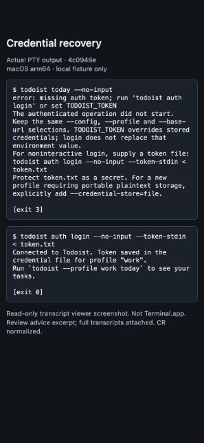
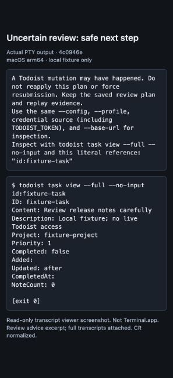

# Recovery consumer review — 2026-09-29

No actionable defect was found in the bounded workflow below. This review used
CLI and README/help revision `4c0946e` (including merged review/replay PR #14).
The locally built executable reports `todoist dev (local) unreleased`; environment
was macOS arm64 with Go 1.27.1. The reviewer wrote the implementation, so this is
not a blind usability study.

## Public route and observed results

Started at README's errors/recovery and daily-review sections, then executed
`todoist review --help`. Configuration and HOME were isolated, the selected
credential profile was `work`, storage was explicitly configured as file, and the
API endpoint was a local fixture. The token was synthetic and never displayed.

The commands were run manually through a real PTY, not just by rerunning the
regression harness. The fixture accepted the update and withheld its response;
SIGINT was then sent to the CLI process while it was waiting. This exercises
interruption semantics, not a literal keyboard Ctrl-C test.

| Command | Exit | Observed state |
| --- | --- | --- |
| `todoist today --no-input` | 3 | Empty credential state; actionable stdin-login guidance. |
| `todoist auth login --no-input --token-stdin < token.txt` | 0 | Synthetic credential stored for `work`. |
| `todoist review --out review-plan.json` | 1 | Changed task content, confirmed, then interrupted after one accepted mutation. Plan and pending evidence retained. |
| `todoist task view --full --no-input id:fixture-task` | 0 | Displayed `Review release notes carefully`, the accepted update; no additional mutation. |
| `todoist review`, choose `keep` after comparison | 0 | Fresh review showed current content and kept it; still one mutation overall. |
| Exact-task inspection with `--json` | 0 | Parseable task object on stdout, empty stderr. |
| Old-plan `agent apply` with `--no-input --json --quiet-json` | 5 | Deliberate negative safety check, not recovery advice: blocked; pending evidence and mutation count unchanged. |
| `todoist review --no-input --json --quiet-json` | 2 | Empty stdout, existing JSON error on stderr; no mutation. |

The fixture's final mutation count was exactly **one**. Replay bytes remained
identical across inspection and the deliberately blocked retry. Machine report
stdout retained `remote_outcome_uncertain: true`; stderr remained the existing
error envelope. The original plan also remained intact.

## Screenshots and transcripts

Terminal.app automation was unavailable in the computer-use tool. These are
browser screenshots of a read-only viewer displaying the actual captured PTY
output, **not Terminal.app screenshots**. CR characters were normalized for the
viewer; review advice is an excerpt. The underlying command text was not rewritten.
Exit annotations are added by the capture harness.

Full [human transcript](transcript.txt) and separately captured
[machine stdout/stderr and exit statuses](machine-results.json) are included.

## Checks and limits

`make check` passed on integrated revision `4c0946e`: formatting, vet, full tests
with coverage, documentation/help, terminal authentication, and module metadata.
The evidence-only documentation commit subsequently passed `make docs-check`.

No live Todoist, real Keychain, completed-history UI, recurring-completion,
SIGKILL/power-loss, or native terminal-window presentation verification was
performed. Actual PTY behavior and fixture mutations were exercised; screenshots
show the transcript viewer's presentation. Manual completed-history reconciliation
remains an explicit limit for outcomes that a task lookup cannot establish.
