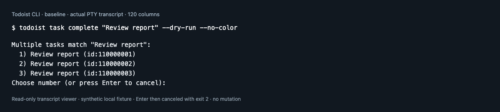
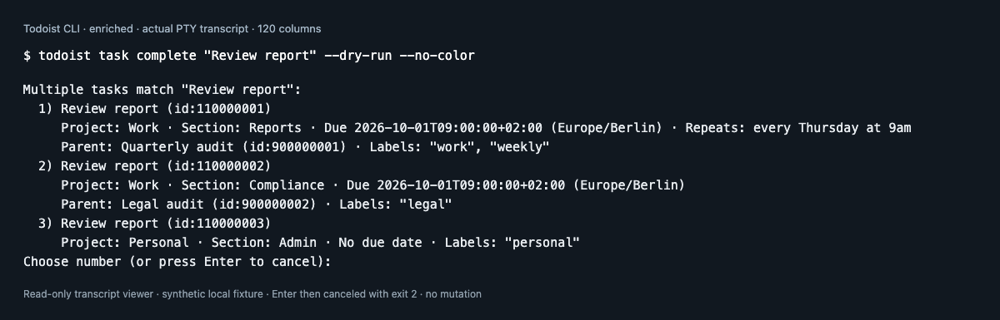

# Task ambiguity prompt evidence

Both images display output captured from actual Todoist CLI processes on macOS
arm64 with Go 1.27.1. The baseline executable was built from
`4e1bd8ae220cf84531fabeacf1d642d893018181`; the enriched executable was rebuilt
from that revision plus the task-ambiguity implementation in the working tree.
Both report `todoist dev (local) unreleased`. Binary and implementation-source
SHA-256 hashes are recorded in [captures.json](captures.json).

Each process ran the same command in a 120-column pseudo-terminal against the
same fresh local HTTP fixture, using isolated configuration and a synthetic
token:

```sh
todoist task complete "Review report" --dry-run --no-color
```

The fixture contains three tasks with that title. Two share a project and timed
due date but have different sections, parents, labels, and recurrence; the third
belongs to Personal and has no due date. The fixture data is included in
[captures.json](captures.json). No live account data, real credentials, or live
Todoist mutations were involved.

These PNGs are **headless Chrome screenshots of a read-only transcript viewer**,
not Terminal.app screenshots. The viewer displays the actual merged stdout and
stderr captured from the PTY, stopping at the choice prompt. Only PTY CRLF is
normalized to LF; the CLI text is not rewritten. The heading, command annotation,
and footer belong to the capture tooling, not the CLI.

| Baseline | Enriched prompt |
| --- | --- |
|  |  |

After each prompt snapshot, Enter was sent to cancel. Both processes retained
the ambiguity error and exited `2`; request logs contained only GET requests.
The full captured output, including cancellation, is retained in
[captures.json](captures.json).

This comparison establishes presentation of actual PTY output and the observed
cancellation path. It does not verify a native terminal application's font
behavior or live Todoist API semantics.
